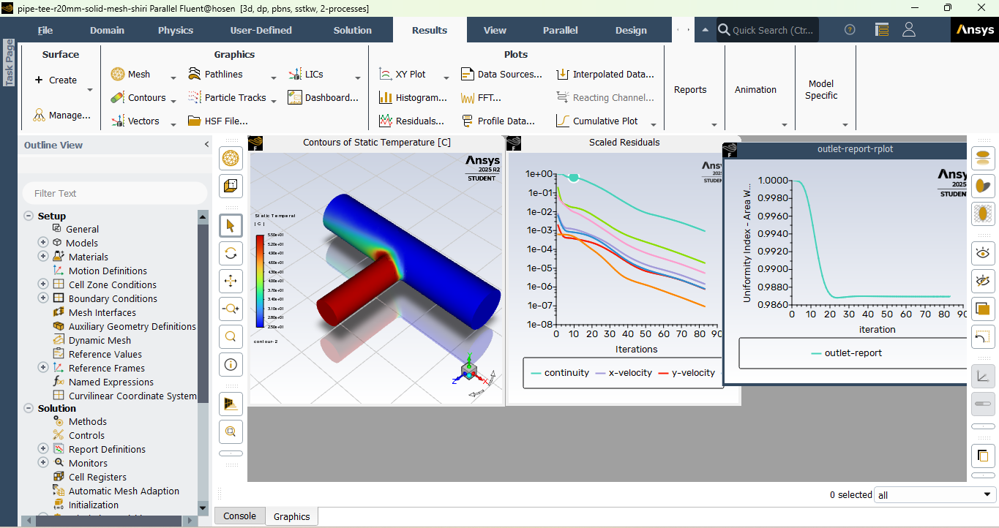

### Air flow simulation using Ansys Fluent
Using Ansys Student 2025 R2

This repository contains the following structure:
1. images folder: contains the solution images, like plots, calculated values and mesh plotting.
2. Readme.md: contains further information about CFD and the project being implemented.
3. pipe-tee-r20mm-solid-mesh-shiri.msh.h5: The pipe-tee-r20mm-solid.msh.h5 file after applying mesh.
4. pipe-tee-r20mm-solid-solution-shiri.msh.h5: The final solution after mesh. By other words the results of the solver on the meshed file.
5. pipe-tee-r20mm-solid.msh.h5: The original file of the T shaped pipe geometry without mesh and without the solution.

This project was made by following this course: https://innovationspace.ansys.com/product/intro-to-ansys-fluent/

##### General Steps of CFD Simulation in Ansys:
1. Geometry Creation or Import

-Use Ansys DesignModeler or SpaceClaim to build or import the fluid domain.

2. Meshing

-Generate a computational mesh using Ansys Meshing.

-Refine mesh in critical regions (e.g. boundary layers, inlets/outlets).

3. Physics Setup

-Choose the solver (pressure-based or density-based for example).

-Define fluid properties (e.g. viscosity, density).

-Select turbulence models, multiphase models, heat transfer, etc.

4. Boundary Conditions

-Apply inlet/outlet conditions, wall boundaries, symmetry, etc.

-Set initial conditions if transient simulation is used.

5. Solution Setup

-Choose steady or transient solver.

-Set discretization schemes and convergence criteria.

6. Initialize the solution.

-Run the Simulation

-Monitor residuals and physical quantities (e.g. velocity, pressure).

-Adjust under-relaxation factors or time steps if needed.

7. Post-Processing

-Use Fluent’s built-in tools to visualize results.

-Generate contour plots, streamlines, vector fields, and data reports.

8. Validation and Refinement

-Compare results with experimental or analytical data.

-Refine mesh or adjust models as needed for accuracy.
